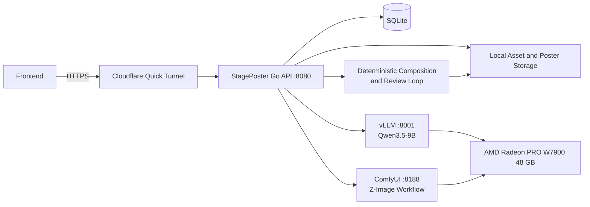

# StagePoster

> AI-native music event poster engine. Deployed and end-to-end verified on AMD Radeon PRO W7900 48 GB + ROCm.

StagePoster transforms structured event briefs into selectable, reviewable,
downloadable complete posters — not just raw generated images.

```text
Structured Event Brief
        ↓
Qwen3.5-9B Art Direction Agent
        ↓
3 Structured Design Plans
        ↓
ComfyUI + Z-Image Turbo → 3 Candidate Images
        ↓
User selects a candidate
        ↓
Go Deterministic Text / Logo / Info Layout
        ↓
Qwen Vision Review + Limited-Round Auto Optimization
        ↓
Final Poster + Thumbnail + Review Evidence
```

---

## Verified Status

| Component | Status | Local Address |
|---|---:|---|
| ComfyUI | Ready | `http://127.0.0.1:8188` |
| Qwen3.5-9B / vLLM | Ready | `http://127.0.0.1:8001` |
| StagePoster Go Backend | Ready | `http://127.0.0.1:8080` |
| SQLite | Ready | `/workspace/persistence/stageposter/data/poster.db` |
| Cloudflare Quick Tunnel | Dev | `https://<random>.trycloudflare.com` |
| Full Poster Pipeline | Passed | 3 candidates → select → compose → review → final |
| Smoke Test | Passed | `scripts/smoke-test.sh` |

### Verified E2E (2026-07-29)

| Field | Result |
|---|---|
| Session | `session_71a2f36d-bd35-4a92-8fe7-92de20aed972` |
| Design Plan | `abyssal-red-dimension` |
| Poster | `poster_5b5c743a-1314-42f9-a186-85053b50d446` |
| Candidates | 3 / 3 ready |
| Selected Candidate | `candidate_cb3c5483-cf02-485a-8b62-9f065ea1203b` |
| Final Status | `completed_with_warnings` |
| Review Rounds | 2 |
| Best Score | 88 |
| Final File | ~1.0 MB PNG (1024×1536) |

`completed_with_warnings` is a valid terminal state. It means the review
reached the maximum rounds and the system retained the highest-scoring usable
version. It does **not** mean the poster failed.

---

## System Architecture



**Public (frontend can see):**
- Cloudflare HTTPS URL → StagePoster Go API :8080

**Private (never exposed to browser):**
- ComfyUI :8188
- vLLM :8001
- SQLite, model files, workflow JSON, node IDs, queue protocol

---

## Quick Start

### One-Click Deploy (fresh environment)

```bash
cd /workspace/poster-engine
sudo -E bash scripts/install-all.sh
```

This installs system deps, Python envs, models (~21 GB), compiles the backend,
and starts all services.

### Daily Startup

```bash
cd /workspace/poster-engine/backend
./scripts/start-all.sh
./scripts/status.sh
./scripts/smoke-test.sh
./scripts/start-dev-tunnel.sh

# Get public URL for frontend
cat run/public-api-url.txt
```

### Build Only

```bash
cd /workspace/poster-engine/backend
go build -o poster-backend ./cmd/server
```

---

## Verified Environment

| Item | Configuration |
|---|---|
| OS | Ubuntu 24.04.4 |
| GPU | AMD Radeon PRO W7900, 48 GB VRAM |
| GPU Architecture | `gfx1100` |
| ROCm | 7.2.1 (HIP 7.2.53211) |
| ComfyUI Python | 3.10.20 |
| ComfyUI Torch | 2.13.0+rocm7.2 |
| vLLM | 0.20.0 |
| vLLM Torch | 2.10.0+git8514f05 |
| Go | 1.25.0 |

### Single-GPU Memory Strategy

Qwen3.5-9B and ComfyUI share one W7900:
1. Brief understanding, plan generation, visual review → wake vLLM
2. Before candidate generation → vLLM sleeps to release VRAM
3. ComfyUI loads image generation model and generates candidates
4. When Qwen review is needed → wake vLLM again

This prevents both models from occupying VRAM simultaneously.

---

## Directory Structure

```text
/workspace/poster-engine/
├── ComfyUI/                         # ComfyUI (git submodule)
├── models/
│   └── Qwen3.5-9B/                  # vLLM model files
├── workflows/
│   └── z_image_poster_v1.json       # ComfyUI workflow template
├── venv/                            # ComfyUI Python 3.10.20 env
├── .venv-vllm/                      # vLLM Python 3.12 env
├── .env                             # Project env vars
├── scripts/                         # Deploy and service scripts
│   ├── install-all.sh               # One-click deploy
│   ├── start-all.sh                 # Start all services
│   ├── stop-all.sh                  # Stop all services
│   ├── status.sh                    # Service status
│   ├── smoke-test.sh                # Smoke test
│   ├── start-dev-tunnel.sh          # Cloudflare tunnel
│   └── ...
├── backend/
│   ├── cmd/server/main.go           # Entry point
│   ├── data/.gitkeep                # SQLite directory (data on NFS)
│   ├── logs/.gitkeep                # Log directory (logs on NFS)
│   ├── run/.gitkeep                 # PID directory (PID files on NFS)
│   ├── storage/.gitkeep             # Storage directory (data on NFS)
│   ├── internal/                    # Go packages
│   └── poster-backend               # Compiled binary
└── docs/                            # Documentation
```

**Persistent data** lives on NFS at `/workspace/persistence/stageposter/`:
- `data/` → SQLite database
- `storage/jobs/` → ComfyUI task outputs
- `storage/assets/` → Uploaded assets
- `storage/posters/` → Final poster outputs
- `logs/` → Service logs
- `run/` → PID files and tunnel URLs

This ensures data survives instance termination.

---

## Models and Workflow

### Qwen3.5-9B

```
/workspace/poster-engine/models/Qwen3.5-9B
```

vLLM served model name: `stageposter-vlm`

### ComfyUI Models

```
/workspace/poster-engine/ComfyUI/models/
├── diffusion_models/
│   └── z_image_turbo_bf16.safetensors
├── text_encoders/
│   └── qwen_3_4b.safetensors
├── vae/
│   └── ae.safetensors
└── loras/
    └── z_image_turbo_distill_patch_lora_bf16.safetensors
```

### Workflow

```
/workspace/poster-engine/workflows/z_image_poster_v1.json
```

Runtime identity: `poster-text@1.0.0`

| Binding | Node ID |
|---|---|
| Positive Prompt | `57:27` |
| Negative Prompt | not bound |
| Seed | `57:3` |

---

## Environment Variables

| Variable | Default | Description |
|---|---|---|
| `LISTEN_ADDR` | `:8080` | Backend listen address |
| `COMFY_URL` | `http://127.0.0.1:8188` | ComfyUI URL |
| `COMFY_VENV` | `/workspace/venv` | ComfyUI Python venv |
| `VLM_URL` | `http://127.0.0.1:8001` | vLLM URL |
| `VLM_API_KEY` | `stageposter-vlm-local` | vLLM API key |
| `VLM_MODEL` | `stageposter-vlm` | vLLM model name |
| `DB_PATH` | `/workspace/persistence/stageposter/data/poster.db` | SQLite path (NFS) |
| `STORAGE_ROOT` | `/workspace/persistence/stageposter/storage/jobs` | Task output dir (NFS) |
| `ASSET_STORAGE_ROOT` | `/workspace/persistence/stageposter/storage/assets` | Asset storage dir (NFS) |
| `POSTER_OUTPUT_ROOT` | `/workspace/persistence/stageposter/storage/posters` | Poster output dir (NFS) |
| `WORKFLOW_PATH` | `workflows/z_image_poster_v1.json` | ComfyUI workflow |
| `WORKFLOW_KEY` | `poster-text` | Workflow identifier |
| `WORKFLOW_VERSION` | `1.0.0` | Workflow version |
| `POSTER_API_TOKEN` | `""` | API auth token |
| `CORS_ORIGIN` | `*` | CORS origin |
| `POSTER_FONT_REGULAR` | `""` | Regular font path |
| `POSTER_FONT_BOLD` | `""` | Bold font path |
| `RECONCILE_INTERVAL` | `2s` | Reconciler poll interval |
| `PROMPT_NODE_ID` | `57:27` | ComfyUI prompt node |
| `SEED_NODE_ID` | `57:3` | ComfyUI seed node |

---

## API Overview

### Base URL

Local: `http://127.0.0.1:8080`
Remote: `https://<random>.trycloudflare.com`

### Health & Dependencies

| Method | Path | Purpose |
|---|---|---|
| `GET` | `/health` | Backend, ComfyUI, database health |
| `GET` | `/api/system/dependencies` | SQLite, ComfyUI, vLLM, sleep state, token status |

### AI Design & Sessions

| Method | Path | Purpose |
|---|---|---|
| `POST` | `/api/ai/design` | Generate 3 structured design directions |
| `POST` | `/api/ai/sessions` | Create interactive AI poster session |
| `GET` | `/api/ai/sessions/{sessionId}` | Get session, plans, candidates, progress |
| `POST` | `/api/ai/sessions/{sessionId}/messages` | Send message to advance brief or plans |
| `POST` | `/api/ai/sessions/{sessionId}/assets` | Bind uploaded assets |
| `POST` | `/api/ai/sessions/{sessionId}/plans/{planId}/confirm` | Confirm plan, generate 3 candidates |
| `POST` | `/api/ai/sessions/{sessionId}/candidates/{candidateId}/select` | Select candidate, run composition |
| `POST` | `/api/ai/sessions/{sessionId}/finalize` | Run visual review + auto-optimization |
| `POST` | `/api/ai/sessions/{sessionId}/cancel` | Cancel session |

### Posters

| Method | Path | Purpose |
|---|---|---|
| `GET` | `/api/posters/{posterId}` | Get poster, candidates, progress |
| `POST` | `/api/posters/{posterId}/select` | Select candidate by `candidateId` |
| `GET` | `/api/posters/{posterId}/candidates/{candidateId}/image` | Download candidate image |
| `GET` | `/api/posters/{posterId}/result` | Download final poster |
| `GET` | `/api/posters/{posterId}/thumbnail` | Download thumbnail |

### Assets

| Method | Path | Purpose |
|---|---|---|
| `POST` | `/api/assets` | Upload asset (multipart/form-data) |
| `GET` | `/api/assets/{assetId}` | Fetch asset |

---

## Create a Session

```bash
curl -fsS -X POST "$API_BASE_URL/api/ai/sessions" \
  -H 'Content-Type: application/json' \
  -d '{
    "brief": {
      "event": {
        "title": "Abyssal Kingdom Festival",
        "artist": "Maverick",
        "date": "2026-08-21",
        "time": "20:00",
        "venue": "Void Arena",
        "presalePrice": "$45",
        "doorPrice": "$60"
      },
      "branding": {},
      "visual": {
        "style": "dark fantasy editorial",
        "theme": "abyssal gothic kingdom",
        "musicGenre": "gothic metal",
        "mood": ["epic", "mysterious", "ritualistic"],
        "preferredColors": ["black", "aged ivory", "deep red"]
      }
    },
    "assets": []
  }'
```

Required fields: `event.title`, `event.artist`, `event.date`, `event.time`,
`event.venue`, `visual.style`, `visual.theme`, `visual.musicGenre`, `visual.mood`.

The backend uses strict JSON decoding. Unknown fields are rejected.

---

## Session State Machine

```text
collecting_brief
    ↓
awaiting_plan_selection
    ↓
generating_candidates
    ↓
awaiting_candidate_selection
    ↓
looping (review rounds)
    ↓
succeeded / completed_with_warnings
```

Other states: `needs_user_input`, `failed`, `cancelled`

**Frontend must follow `availableActions` returned by the backend. Do not guess
allowed actions.**

| State | Common Actions |
|---|---|
| `collecting_brief` | `send_message`, `attach_asset`, `cancel` |
| `awaiting_plan_selection` | `send_message`, `confirm_plan`, `cancel` |
| `generating_candidates` | `refresh`, `cancel` |
| `awaiting_candidate_selection` | `select_candidate`, `cancel` |
| `succeeded` | `finalize`, `download_final` |
| `completed_with_warnings` | `download_final` |

---

## Known Issues

### vLLM sleep mode on ROCm 7.2

`--enable-sleep-mode` causes `CUDA Error: invalid argument` on ROCm 7.2 +
vLLM 0.20.0 during `wake_up`. The startup scripts do **not** enable sleep mode.
W7900's 48 GB VRAM is sufficient to hold both Qwen3.5-9B (~18 GB FP16) and
ComfyUI Z-Image Turbo (~6 GB) simultaneously.

### Candidates stuck at generating

This was caused by `PosterStatusPartialReady` being in the reconciler's
terminal-state skip list, which stopped reconciliation after 1/3 candidates
became ready. Fixed in commit `93cec30`.

### Reconciler goroutine crash

Reconciler goroutines now have `panic recovery` wrappers. A panic is logged as
a warning and the tick loop continues.

---

## Frontend Integration Checklist

- [ ] Read `API_BASE_URL` from `VITE_API_BASE_URL` env
- [ ] Never hardcode the Quick Tunnel URL
- [ ] Only call StagePoster Go API (never ComfyUI or vLLM directly)
- [ ] Create sessions with top-level `brief` object
- [ ] Render Plans and Plan IDs from backend response
- [ ] Poll session status via `GET /api/ai/sessions/{sessionId}`
- [ ] Follow `availableActions` — don't guess
- [ ] Display all 3 Candidate image URLs
- [ ] Use Candidate ID (not index) for selection
- [ ] Both `succeeded` and `completed_with_warnings` allow download
- [ ] Stop polling on `failed` or `cancelled`
- [ ] Allow tunnel URL replacement on restart

Example:

```ts
const apiBaseUrl = import.meta.env.VITE_API_BASE_URL;

const response = await fetch(
  `${apiBaseUrl}/api/system/dependencies`,
);

if (!response.ok) {
  throw new Error(`StagePoster API returned ${response.status}`);
}

const dependencies = await response.json();
```

---

## Daily Operations

```bash
# Start
./scripts/start-all.sh && ./scripts/status.sh

# Check
curl -fsS http://127.0.0.1:8080/api/system/dependencies | python3 -m json.tool

# Logs (on NFS)
tail -f /workspace/persistence/stageposter/logs/backend.log
tail -f /workspace/persistence/stageposter/logs/comfyui.log
tail -f /workspace/persistence/stageposter/logs/vllm.log
tail -f /workspace/persistence/stageposter/logs/cloudflared.log

# Stop tunnel only
kill "$(cat run/cloudflared.pid)" 2>/dev/null || true
rm -f run/cloudflared.pid run/public-api-url.txt

# Stop all
./scripts/stop-all.sh
```

---

## Documentation

| Document | Description |
|---|---|
| [docs/one-click-deployment.md](docs/one-click-deployment.md) | Full one-command deployment |
| [docs/api-contract.md](docs/api-contract.md) | API contract v1.0 |
| [docs/creative-brief-schema.md](docs/creative-brief-schema.md) | Brief schema and prompt translation |
| [docs/error-codes.md](docs/error-codes.md) | Error codes and HTTP status usage |
| [docs/asset-contract.md](docs/asset-contract.md) | Asset upload and lifecycle |
| [docs/job-lifecycle.md](docs/job-lifecycle.md) | Async job states and recovery |
| [docs/conversation-flow.md](docs/conversation-flow.md) | AI conversation state machine |
| [docs/frontend-integration.md](docs/frontend-integration.md) | Frontend integration guide |
| [docs/cloudflare-tunnel.md](docs/cloudflare-tunnel.md) | Cloudflare Quick Tunnel setup |
| [docs/GPU_RUNTIME_REPRODUCTION.md](docs/GPU_RUNTIME_REPRODUCTION.md) | Single-GPU reproduction guide |
| [CLAUDE.md](CLAUDE.md) | Project guide for AI coding agents |
| [AGENTS.md](AGENTS.md) | Engineering rules and architecture boundaries |

Chinese versions of all documents are available with `_cn` suffix
(e.g., `README_cn.md`, `docs/api-contract_cn.md`).
